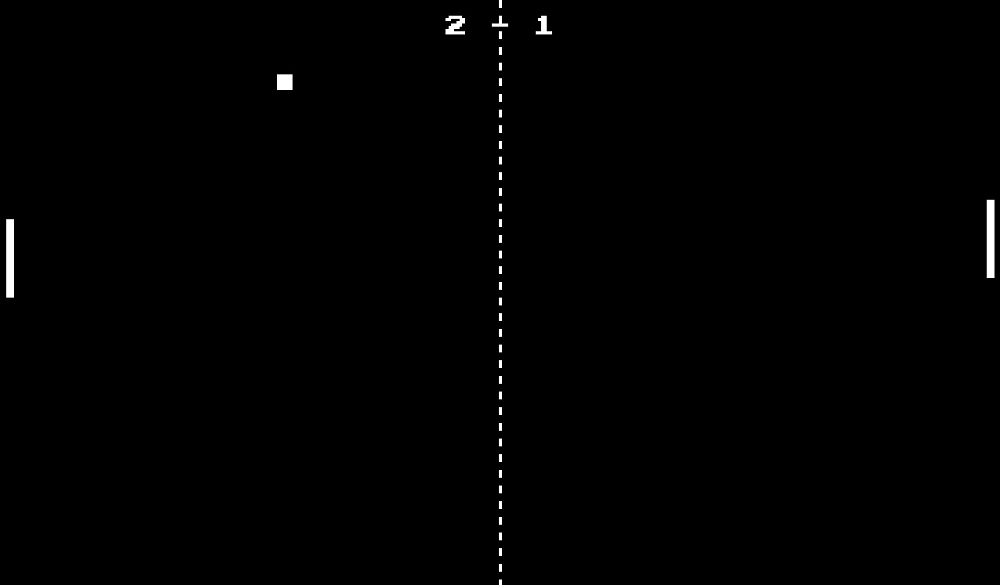

# Ponggers - A 1972 Atari Classic!

## Mô tả

Đây là một phiên bản hiện đại của trò chơi Pong cổ điển được phát triển bằng C++ và SDL2. Trò chơi cho phép hai người chơi điều khiển các thanh trượt (paddle) để đánh bóng qua lại. Người chơi đầu tiên đạt 5 điểm sẽ giành chiến thắng.

### Tính năng

- Đồ họa mượt mà với SDL2
- Hiệu ứng âm thanh khi đánh bóng và ghi điểm
- Nhiều trạng thái trò chơi: màn hình chính, chuẩn bị, chơi, tạm dừng và kết thúc
- Hiển thị điểm số

### Hướng dẫn cài đặt

1. Tải xuống tệp ZIP từ trang phát hành mới nhất
2. Giải nén tất cả các tệp vào một thư mục
3. Chạy tệp `Pong.exe` để bắt đầu trò chơi

## Cách chơi

- **Người chơi bên trái**: Sử dụng phím W để di chuyển lên và S để di chuyển xuống
- **Người chơi bên phải**: Sử dụng phím mũi tên lên và xuống để di chuyển
- **Space**: Bắt đầu trò chơi / Khởi động lại sau khi kết thúc
- **ESC**: Tạm dừng trò chơi

## Ảnh chụp màn hình

### Màn hình chính

### Gameplay

### Kết thúc trò chơi

